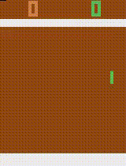

# DQN

使用PyTorch實作DQN演算法，並訓練super-mario-bros以及atari-pong，整體架構參考openai/baselines。  

*Warning*：訓練DQN請開足夠的記憶體，Replay Buffer以預設值1000000為例至少會使用約8G的記憶體。
  
# Dependencies

* Python 3.6
* Anaconda
* PyTorch
* gym
* gym[atari]
* ppaquette_gym_super_mario
* fceux
  
# Getting Started

以下以Ubuntu 16.04 LTS環境為準，安裝Anaconda時請一路Enter與Yes到底。

```
wget https://repo.continuum.io/archive/Anaconda3-4.4.0-Linux-x86_64.sh
bash Anaconda3-4.4.0-Linux-x86_64.sh
source .bashrc
conda install pytorch torchvision -c soumith
conda install libgcc
pip install gym[Atari]
sudo apt-get update
sudo apt-get install -y python-numpy python-dev cmake zlib1g-dev libjpeg-dev xvfb libav-tools xorg-dev python-opengl libboost-all-dev libsdl2-dev swig
sudo apt-get install fceux
pip install git+https://github.com/ppaquette/gym-super-mario/
```
  
# How to run

* super-mario-bros
```
xvfb-run -s "-screen 0 1400x900x24" python train_mario.py
```
  
* atari-pong
```
python train_pong.py
```

# Result

* Super-Mario-Bros

使用8顆cpu在GCP上跑16個小時，RAM開24G非常足夠，但很難收斂，無法穩定過關。  
訓練的影像預設位置在/video/mario/。


* Atari-Pong

使用4顆cpu在GCP上跑8個小時，能夠穩定大幅贏電腦。  
訓練的影像預設位置在/video/gym-reslults/。




# References

[Playing Atari with Deep Reinforcement Learning](https://www.cs.toronto.edu/~vmnih/docs/dqn.pdf)  
[openai/baselines](https://github.com/openai/baselines)  
[transedward/pytorch-dqn](https://github.com/transedward/pytorch-dqn)  
[openai/gym](https://github.com/openai/gym)  
[ppaquette/gym-super-mario](https://github.com/ppaquette/gym-super-mario)  
